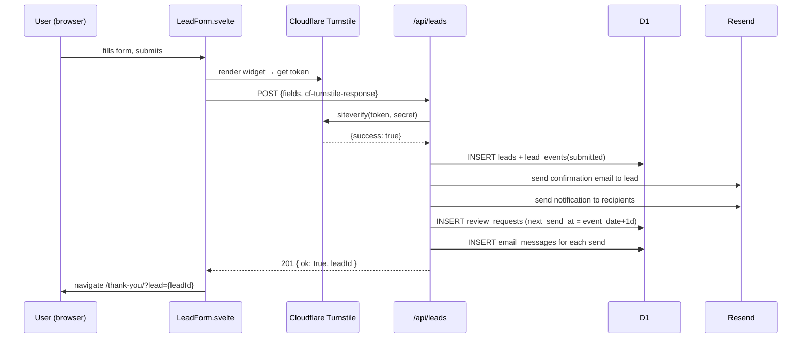
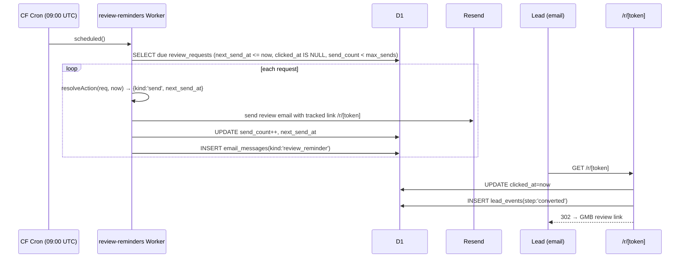

# Design: Package Lead Capture CRO

## Technical Approach

Extend the prerendered SvelteKit site with a dynamic POST endpoint and a standalone Cloudflare Worker for cron, sharing a single D1 database. The package detail page stays fully prerendered; all server I/O is isolated in `src/lib/server/` modules with explicit pure vs I/O boundaries to enable unit testing without a live D1.

---

## Architecture Decisions

| Decision | Choice | Rejected | Rationale |
|----------|--------|----------|-----------|
| **D1 over KV** | D1 (relational, SQL, migrations) | KV | Lead data is relational (leads → events → messages → review_requests). SQL gives FK integrity, indexes, and JOIN queries for the reminder Worker without serializing blobs. |
| **Separate cron Worker** | `workers/review-reminders/` with own `wrangler.toml` | In-worker `scheduled` handler | `adapter-cloudflare` generates a `_worker.js` with NO `scheduled` export — adding one is unsupported and would break on every rebuild. Separate Worker is the only safe approach. |
| **POST endpoint over form action** | `src/routes/api/leads/+server.ts` | SvelteKit form action on `[slug]` | `[slug]` has `export const prerender = true`. Form actions require a server route, which cannot coexist with `prerender = true` on the same route. A separate API route avoids touching the prerender config. |
| **Turnstile managed widget** | Cloudflare Turnstile JS embed (managed mode) | Invisible / custom challenge | Managed mode is the least invasive — one `<div>` target, one script tag, one callback. No manual iframe management. Server-side `siteverify` via `fetch` (no Node SDK needed). |

---

## D1 Schema (migrations/0001_init.sql)

```sql
-- leads
CREATE TABLE IF NOT EXISTS leads (
  id           TEXT PRIMARY KEY,          -- crypto.randomUUID()
  package_slug TEXT NOT NULL,
  name         TEXT NOT NULL,
  email        TEXT NOT NULL,
  phone        TEXT,
  event_date   TEXT,                      -- ISO date YYYY-MM-DD
  message      TEXT,
  lang         TEXT NOT NULL DEFAULT 'es',
  status       TEXT NOT NULL DEFAULT 'new', -- new | contacted | converted | lost
  created_at   TEXT NOT NULL,             -- ISO 8601 UTC
  updated_at   TEXT NOT NULL
);
CREATE INDEX idx_leads_package_slug ON leads(package_slug);
CREATE INDEX idx_leads_status       ON leads(status);

-- lead_events (audit trail)
CREATE TABLE IF NOT EXISTS lead_events (
  id         TEXT PRIMARY KEY,
  lead_id    TEXT NOT NULL REFERENCES leads(id),
  step       TEXT NOT NULL,  -- submitted | email_sent | notified | review_requested | converted | lost
  meta       TEXT,           -- JSON blob (e.g. message_id from Resend)
  created_at TEXT NOT NULL
);
CREATE INDEX idx_lead_events_lead_id ON lead_events(lead_id);

-- email_messages (Resend send log)
CREATE TABLE IF NOT EXISTS email_messages (
  id         TEXT PRIMARY KEY,
  lead_id    TEXT NOT NULL REFERENCES leads(id),
  kind       TEXT NOT NULL,  -- confirmation | notification | review_reminder
  resend_id  TEXT,           -- Resend message ID
  sent_at    TEXT NOT NULL,
  status     TEXT NOT NULL DEFAULT 'sent' -- sent | failed
);
CREATE INDEX idx_email_messages_lead_id ON email_messages(lead_id);

-- review_requests
CREATE TABLE IF NOT EXISTS review_requests (
  id           TEXT PRIMARY KEY,
  lead_id      TEXT NOT NULL REFERENCES leads(id),
  token        TEXT NOT NULL UNIQUE,
  event_date   TEXT NOT NULL,          -- ISO date
  next_send_at TEXT NOT NULL,          -- ISO 8601 UTC; when to fire next reminder
  send_count   INTEGER NOT NULL DEFAULT 0,
  max_sends    INTEGER NOT NULL DEFAULT 3,
  clicked_at   TEXT,                   -- NULL = not clicked; set on /r/[token]
  created_at   TEXT NOT NULL
);
CREATE INDEX idx_review_requests_next_send_at ON review_requests(next_send_at);
CREATE UNIQUE INDEX idx_review_requests_token ON review_requests(token);

-- recipients (per-package or global notification targets)
CREATE TABLE IF NOT EXISTS recipients (
  id          TEXT PRIMARY KEY,
  package_id  TEXT,          -- NULL = global
  email       TEXT NOT NULL,
  active      INTEGER NOT NULL DEFAULT 1,  -- 0 = disabled
  created_at  TEXT NOT NULL
);
CREATE INDEX idx_recipients_package_id ON recipients(package_id);
```

**Enums (TEXT, enforced in app layer):**
- `leads.status`: `new | contacted | converted | lost`
- `lead_events.step`: `submitted | email_sent | notified | review_requested | converted | lost`
- `email_messages.kind`: `confirmation | notification | review_reminder`

---

## Server Lib Module Boundaries

```
src/lib/server/
├── db/
│   ├── client.ts        # I/O — returns D1Database from platform.env.DB; re-exported
│   └── queries.ts       # I/O — raw SQL helpers (insertLead, insertEvent, etc.)
├── email/
│   ├── resend.ts        # I/O — Resend REST via fetch (no SDK, avoids Node dep)
│   └── templates/
│       ├── confirmation.ts   # Pure — (lead, lang) → {subject, html}
│       ├── notification.ts   # Pure — (lead, recipients[]) → {subject, html}
│       └── review.ts         # Pure — (token, lang, siteUrl) → {subject, html}
├── leads/
│   ├── schema.ts        # Pure — Zod schema (LeadInput), exported type
│   ├── normalize.ts     # Pure — raw form data → LeadInput (trim, phone format)
│   ├── recipients.ts    # I/O — resolves email targets: D1 active rows for package_id,
│   │                    #        fallback global rows, fallback env LEAD_NOTIFY_EMAILS
│   └── service.ts       # I/O — orchestrates: insert lead → send emails → create review_request
└── reviews/
    └── sequence.ts      # PURE — (review_request, now: Date) → Action
                         # Action: { kind: 'send' | 'skip' | 'stop', next_send_at?: string }
                         # Inputs only: no D1, no fetch. Unit-testable with Vitest.
```

**`reviews/sequence.ts` contract:**

```ts
export type ReviewRequest = {
  next_send_at: string; // ISO UTC
  send_count: number;
  max_sends: number;
  clicked_at: string | null;
};
export type SequenceAction =
  | { kind: 'stop' }
  | { kind: 'skip' }
  | { kind: 'send'; next_send_at: string };

export function resolveAction(req: ReviewRequest, now: Date): SequenceAction
```

**`leads/recipients.ts` resolution order:**
1. `SELECT email FROM recipients WHERE package_id = ? AND active = 1`
2. If empty: `SELECT email FROM recipients WHERE package_id IS NULL AND active = 1`
3. If still empty: `env.LEAD_NOTIFY_EMAILS.split(',').map(s => s.trim())`

---

## Endpoint Design

**`src/routes/api/leads/+server.ts`**

```ts
export const prerender = false; // explicit; parent layout must not force prerender
```

Validation pipeline (fail-fast, in order):
1. Zod parse `LeadInput` → 400 on fail
2. Honeypot field present → 200 (silent discard)
3. Turnstile `siteverify` via `fetch('https://challenges.cloudflare.com/turnstile/v1/siteverify', { method: 'POST', body: FormData })` with `TURNSTILE_SECRET_KEY` → 400 on fail
4. Rate-limit: count leads by IP (via CF-Connecting-IP header) in last 60s from D1 → 429 if > 3

D1 access: `event.platform.env.DB` (typed via `App.Platform` in `src/app.d.ts`).

Response contract:
- `201 { ok: true, leadId: string }` on success
- `400 { ok: false, error: string }` on validation fail
- `429 { ok: false, error: 'rate_limited' }` on rate limit
- `500 { ok: false, error: 'internal' }` on unexpected error (no leak)

**`src/routes/r/[token]/+server.ts`** — GET handler, not prerendered:
1. Query `review_requests WHERE token = ?`
2. If not found → 404
3. Set `clicked_at = now`, stop sequence
4. `INSERT lead_events (step: 'converted')`
5. `302` to GMB link from `site.ts`

---

## Worker Architecture

```
workers/review-reminders/
├── wrangler.toml      # own name, main = src/index.ts, [[d1_databases]], [triggers]
├── tsconfig.json      # extends ../../tsconfig.json, paths alias for src/lib/server
└── src/
    └── index.ts       # scheduled handler
```

**`workers/review-reminders/wrangler.toml` key sections:**
```toml
name = "meg-review-reminders"
main = "src/index.ts"
compatibility_date = "2024-05-02"

[[d1_databases]]
binding = "DB"
database_name = "meg-leads"
database_id = "<same-id>"

[triggers]
crons = ["0 9 * * *"]  # 09:00 UTC daily

[vars]
PUBLIC_SITE_URL = "https://malagaeventgear.com"
```

**Shared code import strategy:** The Worker's `tsconfig.json` sets `paths: { "$lib/*": ["../../src/lib/*"] }`. Wrangler bundles at build time, so `reviews/sequence.ts` and `email/templates/review.ts` (both pure) are inlined into the Worker bundle. `db/queries.ts` and `email/resend.ts` (I/O) are also imported — no Node APIs in either, only `fetch` and D1 bindings. This works because the shared lib already obeys the Cloudflare constraint.

**Two deploy targets:**
- `bun run deploy` → deploys main SvelteKit Worker via root `wrangler.toml`
- `cd workers/review-reminders && bun run deploy` → deploys cron Worker
- D1 migrations apply once: `wrangler d1 migrations apply meg-leads`

---

## Sequence Diagrams

**A — Lead submission flow**



**B — Review reminder flow**



---

## Turnstile Integration

**Client** (`LeadForm.svelte`):
```html
<!-- In <head> or lazy-loaded -->
<script src="https://challenges.cloudflare.com/turnstile/v1/api.js" async defer></script>

<div class="cf-turnstile" data-sitekey={PUBLIC_TURNSTILE_SITE_KEY} data-callback="onTurnstileSuccess"></div>
```
Token stored in `$state` via callback, included in POST body as `cf-turnstile-response`.

**Server** (`/api/leads`): `fetch` to `https://challenges.cloudflare.com/turnstile/v1/siteverify` with `secret` + `response` (+ optional `remoteip`). No SDK. Pure Web API.

**Dev keys:** `TURNSTILE_SITE_KEY=1x00000000000000000000AA` (always passes), `TURNSTILE_SECRET_KEY=1x0000000000000000000000000000000AA`.

---

## Tracking (/thank-you/)

`/thank-you/+page.svelte` reads `?lead=` query param (client-side, `$page.url.searchParams`). On mount:

```ts
// Zaraz/GA dataLayer contract
window.dataLayer = window.dataLayer || [];
window.dataLayer.push({
  event: 'lead_submitted',
  lead_id: leadId,
  package_slug: packageSlug  // passed via ?pkg= param
});
```

Page is `noindex` via `<SeoHead noindex={true} />` (or a `<meta name="robots" content="noindex">` if SeoHead doesn't support that prop — add the prop if needed).

---

## Testing Strategy

**Vitest config** (`vitest.config.ts` at root — new file):
```ts
import { defineConfig } from 'vitest/config';
export default defineConfig({
  test: {
    environment: 'node',
    include: ['src/lib/server/**/*.test.ts', 'workers/**/*.test.ts']
  }
});
```

| Layer | Scope | Approach |
|-------|-------|----------|
| Unit | `normalize.ts`, `sequence.ts`, `templates/*.ts`, `schema.ts` | Vitest, pure functions, zero deps |
| Integration | `queries.ts`, `service.ts`, `recipients.ts` | Vitest + miniflare (local D1); fetch mocked via `vi.mock` for Resend |
| E2E | Form → thank-you happy path; /r/[token] redirect; Testimonials on package page | Playwright (already configured) |

`sequence.ts` is the highest-value unit test target — all D+1/D+3/D+5, max_sends, clicked_at branches testable without any I/O.

---

## File Changes

| File | Action | Description |
|------|--------|-------------|
| `migrations/0001_init.sql` | Create | D1 DDL — all 5 tables + indexes |
| `wrangler.toml` | Modify | Add D1 binding, Turnstile vars, secrets reference |
| `src/app.d.ts` | Modify | `App.Platform` with `DB: D1Database`, `TURNSTILE_SECRET_KEY`, `RESEND_API_KEY`, `RESEND_FROM`, `LEAD_NOTIFY_EMAILS`, `PUBLIC_SITE_URL` |
| `src/lib/server/db/client.ts` | Create | DB accessor from platform.env |
| `src/lib/server/db/queries.ts` | Create | SQL helpers: insert/update for all tables |
| `src/lib/server/email/resend.ts` | Create | fetch-based Resend send wrapper |
| `src/lib/server/email/templates/confirmation.ts` | Create | Bilingual HTML template |
| `src/lib/server/email/templates/notification.ts` | Create | Internal notification template |
| `src/lib/server/email/templates/review.ts` | Create | Review reminder template with tracked link |
| `src/lib/server/leads/schema.ts` | Create | Zod schema for LeadInput |
| `src/lib/server/leads/normalize.ts` | Create | Raw form → LeadInput, pure |
| `src/lib/server/leads/recipients.ts` | Create | Recipient resolution, I/O |
| `src/lib/server/leads/service.ts` | Create | Lead submission orchestrator, I/O |
| `src/lib/server/reviews/sequence.ts` | Create | Pure sequence decision function |
| `src/routes/api/leads/+server.ts` | Create | POST endpoint |
| `src/routes/r/[token]/+server.ts` | Create | GET tracked redirect |
| `src/routes/(public)/packages/[slug]/+page.svelte` | Modify | CRO layout + LeadForm embed |
| `src/routes/(public)/thank-you/+page.svelte` | Create | noindex confirmation page |
| `src/lib/components/forms/LeadForm.svelte` | Create | Lead capture form with Turnstile |
| `src/lib/components/forms/PhoneInput.svelte` | Create | Country-code phone selector |
| `src/lib/i18n/translations.ts` | Modify | Add `leadForm` + `thankYou` namespaces (EN + ES) |
| `src/lib/data/site.ts` | Read only | GMB review link reuse |
| `workers/review-reminders/wrangler.toml` | Create | Cron Worker config |
| `workers/review-reminders/tsconfig.json` | Create | Path aliases to shared lib |
| `workers/review-reminders/src/index.ts` | Create | `scheduled()` handler |
| `vitest.config.ts` | Create | Vitest root config |

---

## Open Questions

- [ ] Does `SeoHead.svelte` support a `noindex` prop, or does `/thank-you/` need a manual `<meta>` tag?
- [ ] Rate-limit D1 query uses CF-Connecting-IP — confirm header availability in `adapter-cloudflare` requests (expected yes, but verify in local dev with Wrangler).
- [ ] `PUBLIC_SITE_URL` needed in the main Worker for `/r/[token]` absolute URLs in emails — confirm it can be a `[vars]` entry (non-secret) in `wrangler.toml`.
